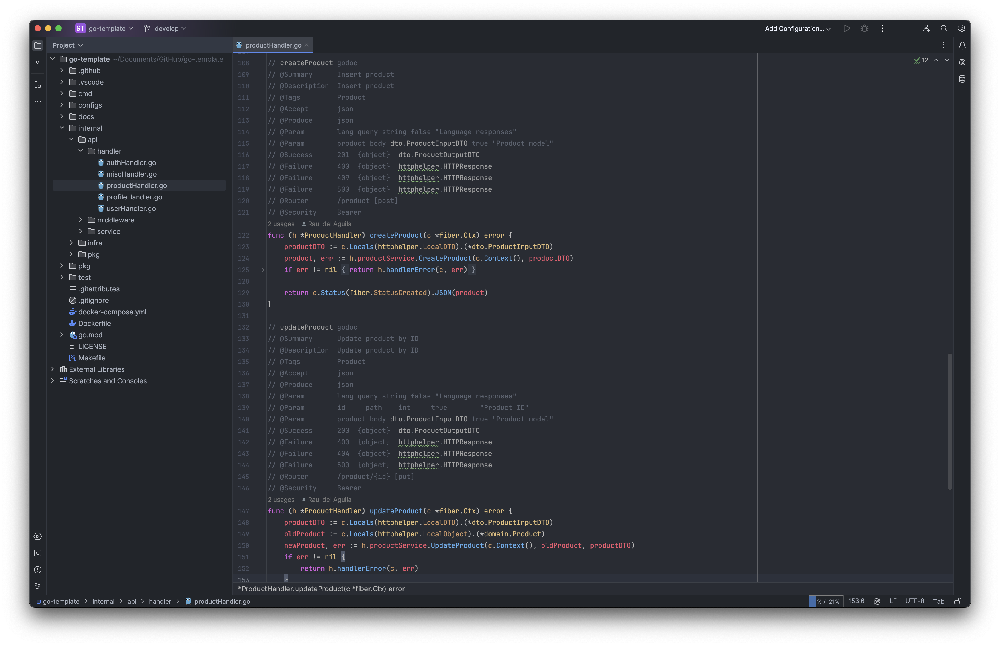

<h1 style="text-align:center">Pro Dark Theme</h1>
  

> [Pro Dark](https://plugins.jetbrains.com/plugin/24501) theme for JetBrains.

## Installation

- Using the IDE built-in plugin system:
  
  <kbd>Settings/Preferences</kbd> > <kbd>Plugins</kbd> > <kbd>Marketplace</kbd> > <kbd>Search for "Pro Dark Theme"</kbd> >
  <kbd>Install</kbd>
  
- Manually:

  Download the [latest release](https://github.com/raulaguila/jetbrains-pro-dark-theme/releases/latest) and install it manually using
  <kbd>Settings/Preferences</kbd> > <kbd>Plugins</kbd> > <kbd>⚙️</kbd> > <kbd>Install plugin from disk...</kbd>

## Code status

- Development

## Contributors

## License

Copyright © 2024 [raulaguila](https://github.com/raulaguila).
This project is [ICS](../LICENSE) licensed.

---
Plugin based on the [IntelliJ Platform Plugin Template][template].

[template]: https://github.com/JetBrains/intellij-platform-plugin-template
[docs:plugin-description]: https://plugins.jetbrains.com/docs/intellij/plugin-user-experience.html#plugin-description-and-presentation
